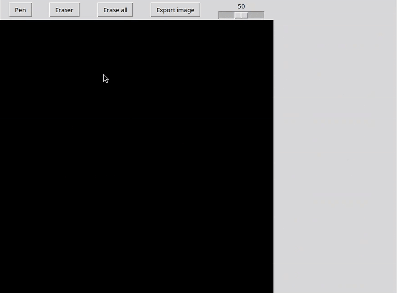

# Handwriting recognition



Handwriting recognition model implemented with my library [MPNeuralNetwork](https://github.com/maximepires4/mp-neural-network) with a gui (MNIST database).

## Image processing

Inspired by the [MNIST database wikipedia page](https://en.wikipedia.org/wiki/MNIST_database#MNIST), the drawn digit is cleaned to look like the dataset images.

The image is processed in several steps:
1.  The image is cropped to the bounding box of the digit.
2.  It is resized to fit within a 20x20 pixel box, while maintaining its aspect ratio.
3.  The center of mass of the digit is computed.
4.  The resized image is pasted onto a 28x28 black canvas, aligning the center of mass with the center of the canvas.

## Usage

### Create a model

Create, train and save a model inside `output/model.pkl`.

```bash
python3 create_model.py
```

To modify the model, edit the variable `network` inside `create_model.py`

### Test the model

Launch a gui for manually testing the model

```bash
python3 main.py
```

## Requirements

* tkinter : `sudo apt install python3-tk`

## Credits

User [nikhilkumarsingh](https://github.com/nikhilkumarsingh) for the gui [base code](https://gist.github.com/nikhilkumarsingh/85501ee2c3d8c0cfa9d1a27be5781f06).
